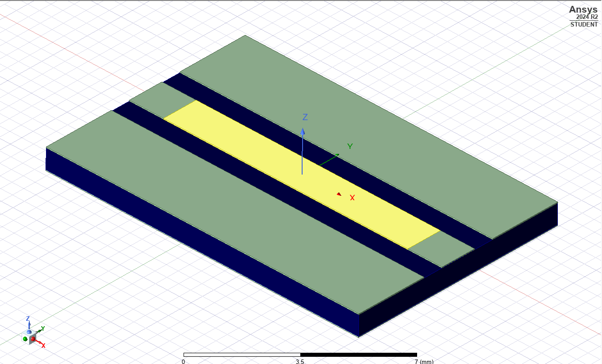

# High-Frequency Circuit Design and Transmission Line Project

High-frequency circuit design, particularly when designing transmission lines and antenna feed structures on a PCB (Printed Circuit Board), shows that the lengths of the transmission lines are selected according to a certain ratio of the wavelength, as observed in the literature and various studies. These ratios are typically expressed as λ/6, λ/8, λ/10, or λ/12, and all of these approaches are based on engineering approximations. One of the key resources that helped me gain more insight into this topic was a video by Zach Paterson ([Watch here](https://www.youtube.com/watch?v=raG6piNjtxE&pp=ygUWYWx0aXVtIGFjYWRlbXkgcmYgY2FsYw%3D%3D)), for which I am deeply grateful.

In RF (Radio Frequency) designs, these approaches generally provide a reference point, but it’s important to emphasize that each parameter should be tailored to the geometric structure and environmental conditions where the design is being implemented. This highlights the significant role that increasing the number of tests and experiments plays in obtaining more accurate results. Therefore, repeated experiments are crucial for reaching correct solutions, and such trials should be continuously pursued throughout the design process.

In this project, I chose the SourceForge platform, which allowed me to perform calculations with a greater number of parameters. Although these calculations do not guarantee absolute accuracy, they increase the likelihood of obtaining results closer to reality. Afterward, I used HFSS (High Frequency Structural Simulator) software to design and analyze my circuit model. Initial analyses showed that the circuit did not fully meet the requirements. At this stage, I referred to the methods provided by ANSYS (for impedance matching operations) and determined the combination of impedance matching elements before the transmission line via the Smith chart, then calculated the values of these elements.

Since this design was intended for real-world use, I reevaluated the design using real components available on the market instead of the theoretical ideal values. After testing and iteration, I finalized my circuit. At the final stage of my project, the result documents included in the project file detail the values and outcomes the project has reached. At this stage, I thoroughly examined how theoretical design approaches align with practical production processes and how the design was improved with various optimizations.

([to access the project where I used this design](https://github.com/FTHGL/LoRa_MuPr-VAF4751))

The circuit diagram of the impedance matching elements—resistors, inductors, and capacitors to be added before the transmission line as a result of the impedance matching—along with their calculated values, are included in the HFSS project files.

**This project was designed for **868 MHz**, and you can also review my project for **1800 MHz** in a similar manner.**

([Minimized-1800 MHz-Transmission-Line-with-FR-4-Substrate](https://github.com/FTHGL/Minimized-1800-MHz-Transmission-Line-with-FR-4-Substrate/tree/main))

